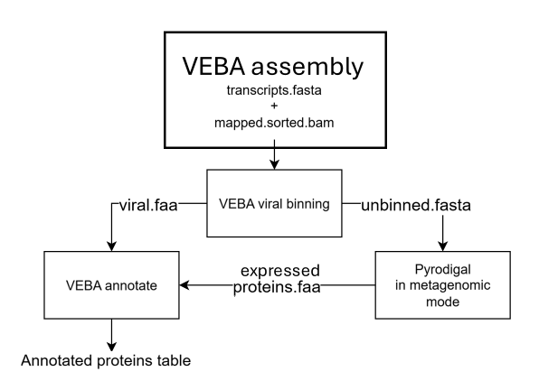

### Annotating proteins from metatranscriptomics

In metatranscriptomics, only viral genomes can be reliably recovered from transcript assemblies — prokaryotic and eukaryotic genome binning is not applicable because transcript data does not contain the full genomic structure needed to reconstruct complete genomes.

This pipeline works around that by recovering viral virus genomes normally through VEBA's viral binning module and processing the unbinned transcripts in metagenomic mode using Pyrodigal to identify expressed protein-coding regions. All the proteins recovered this way represent the active gene expression at the time of sampling.


## Pipeline Overview



*Diagram made by Paulo Tanicala
_____________________________________________________

#### Steps:

1. Preprocess reads and get directory set up
2. Assemble reads, map reads to assembly, and calculate assembly statistics
3. Recover viruses from metatranscriptomics assemblies
4. Identify expressed proteins from unbinned transcripts
5. Annotate viral and expressed prokaryotic proteins

*Remember to use each step's respective Conda Environment

#### 1. Preprocess reads and get directory set up

This is a quick rundown of how to download and preproccess Human lower respiratory tract samples although you can find a more detailed walkthrough of how to work with other reads here: [downloading and preprocessing reads workflow](download_and_preprocess_reads.md)

1.set up list of identifiers and create directories
```
conda activate VEBA-preprocess_env
mkdir -p logs/
mkdir -p Fastq/
cat identifiers.list
```
2. Make sure your VEBA database path is set which is required for human contamination removal and rRNA filtering
```
echo $VEBA_DATABASE
# If nothing prints, set it manually:
# export VEBA_DATABASE=/path/to/veba/database
```
3. Trim reads, remove human contamination, and filter ribosomal reads
```
N_JOBS=4

HUMAN_INDEX=${VEBA_DATABASE}/Contamination/chm13v2.0/chm13v2.0

RIBOSOMAL_KMERS=${VEBA_DATABASE}/Contamination/kmers/ribokmers.fa.gz

for ID in $(cat identifiers.list); do

	R1=Fastq/${ID}_1.fastq.gz
	R2=Fastq/${ID}_2.fastq.gz
	N=preprocessing__${ID}
	rm -f logs/${N}.*

	CMD="source activate VEBA && veba --module preprocess --params \"-n ${ID} -1 ${R1} -2 ${R2} -p ${N_JOBS} -x ${HUMAN_INDEX} -k ${RIBOSOMAL_KMERS} --retain_contaminated_reads 0 --retain_kmer_hits 0 --retain_non_kmer_hits 0 -o veba_output/preprocess\""

	# Either run this command or use SunGridEngine/SLURM

	done
```

**Your output should look like this:
* 
*
*

Your proccessed reads will go to:
```
veba_output/preprocess/${ID}/output/cleaned_1.fastq.gz
veba_output/preprocess/${ID}/output/cleaned_2.fastq.gz
```
#### 2. Assemble reads, map reads to assembly, and calculate assembly statistics

Here we assemble the cleaned reads into transcripts using `rnaSPAdes`

```
N_JOBS=4

# Output directory
OUT_DIR=veba_output/transcript_assembly

mkdir -p logs

for ID in $(cat identifiers.list); do

	N="assembly__${ID}"
	rm -f logs/${N}.*

	R1=veba_output/preprocess/${ID}/output/cleaned_1.fastq.gz
	R2=veba_output/preprocess/${ID}/output/cleaned_2.fastq.gz

	CMD="source activate VEBA && veba --module assembly --params \"-1 ${R1} -2 ${R2} -n ${ID} -o ${OUT_DIR} -p ${N_JOBS} -P rnaspades.py\""

	# Either run this command or use SunGridEngine/SLURM

	done
```
**Your output should look like this:
* 
*
*

#### 3. Recover viruses from metatranscriptomic assemblies

We use *geNomad* and to detect and quality-filter viral sequences from the transcript assembly. This is only viral binning and prokaryotic and eukaryotic binning does not apply to transcript data. Unbinned transcripts will be handled in the next step.

```
N_JOBS=4

for ID in $(cat identifiers.list); do

	N="binning-viral__${ID}"
	rm -f logs/${N}.*

	FASTA=veba_output/transcript_assembly/${ID}/output/transcripts.fasta
	BAM=veba_output/transcript_assembly/${ID}/output/mapped.sorted.bam

	CMD="source activate VEBA && veba --module binning-viral --params \"-f ${FASTA} -b ${BAM} -n ${ID} -p ${N_JOBS} -m 1500 -o veba_output/binning/viral -a genomad\""

	# Either run this command or use SunGridEngine/SLURM

	done
```

**Your output should look like this:
* 
*
*

#### 4. Identify expressed proteins from unbinned transcripts

Anything not classified as viral is assumed to be prokaryotic and since we cannot assemble full prokaryotic genomes from transcripts. We will use Pyrodigal on the unbinned transcripts from the last step to identify protein producing regions.

```
N_JOBS=1

for ID in $(cat identifiers.list); do

	N="pyrodigal__${ID}"
	rm -f logs/${N}.*

	UNBINNED=veba_output/binning/viral/${ID}/output/unbinned.fasta
	OUT=veba_output/expressed_proteins/${ID}
	mkdir -p ${OUT}

	CMD="source activate VEBA-binning-viral_env && pyrodigal \
		-p meta \
		-i ${UNBINNED} \
		-g 11 \
		-f gff \
		-d ${OUT}/expressed_genes.ffn \
		-a ${OUT}/expressed_proteins.faa \
		--min-gene 90 \
		--min-edge-gene 60 \
		--max-overlap 60 \
		> ${OUT}/gene_models.gff"

	# Either run this command or use SunGridEngine/SLURM

	done
```

An example of running this using SLURM:

```
	#sbatch \
        --job-name=${N} \
        --output=logs/${N}.o%j \
        --error=logs/${N}.e%j \
        --partition=shared \
        --nodes=1 \
        --ntasks-per-node=1 \
        --cpus-per-task=${N_JOBS} \
        --mem=16G \
        --time=02:00:00 \
        --account=My_Allocation \
        --wrap="${CMD}"
```

**Your output should look like this:
* 
*
*

#### 5. Annotate viral and expressed prokaryotic proteins

Now we combine the viral proteins from step 3 with the expressed prokaryotic proteins from step 4 and annotate them together using VEBA's annotation module. This searches each protein against multiple reference databases to assign function labels.

1. Concatenate viral and expressed proteins for each sample
```
for ID in $(cat identifiers.list); do

	OUT=veba_output/annotations/${ID}
	mkdir -p ${OUT}

	cat veba_output/binning/viral/${ID}/output/genomes/*.faa \
	    veba_output/expressed_proteins/${ID}/expressed_proteins.faa \
	    > ${OUT}/all_proteins.faa

	done
```

2. Run VEBA's annotation module on the combined protein file
```
N_JOBS=4

for ID in $(cat identifiers.list); do

	N="annotate__${ID}"
	rm -f logs/${N}.*

	PROTEINS=veba_output/annotations/${ID}/all_proteins.faa

	CMD="source activate VEBA && veba --module annotate --params \"-f ${PROTEINS} -o veba_output/annotations/${ID} -p ${N_JOBS}\""

	# Either run this command or use SunGridEngine/SLURM

	done
```

**Your output should look like this:
* 
*
*
